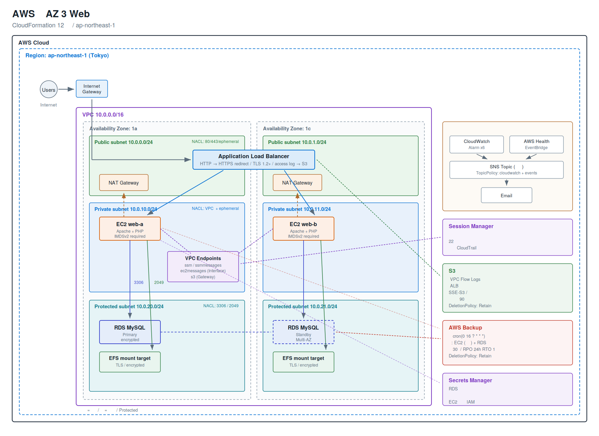

# AWS マルチAZ 3層Webアーキテクチャ基盤（CloudFormation による IaC 化）

AWS 上にマルチAZ構成の3層Webアーキテクチャを、AWS CloudFormation による Infrastructure as Code で構築した個人学習プロジェクトです。可用性・セキュリティ・運用監視・バックアップまでを含めた構成を、全12スタックで実装しています。

全スタックは `Export` / `Fn::ImportValue` によるクロススタック参照で連携しており、リソースIDを手作業で受け渡す箇所はありません。

---

## 構成図



図のソースは [`docs/architecture.svg`](docs/architecture.svg) です（テキストベースのため差分管理が可能）。

---

## 主な特徴

| 観点 | 実装内容 |
|---|---|
| 可用性 | マルチAZ構成、NATゲートウェイをAZごとに冗長化、RDS Multi-AZ、ALBによる負荷分散 |
| ネットワーク | Public / Private / Protected の3階層 × 2AZ = 計6サブネット、層ごとに分けたネットワークACLによる多層防御 |
| セキュリティ | セキュリティグループのチェーン構成、IAMの最小権限設計、IMDSv2の強制、保存時・転送時の暗号化 |
| 認証情報管理 | RDSマネージドパスワードにより、テンプレート・リポジトリ・イベント履歴のいずれにもパスワードが現れない |
| 運用 | 踏み台サーバーレス（Session Manager + Interface VPCエンドポイント）、CloudWatchアラーム、SNS通知、EventBridge（AWS Health連携） |
| バックアップ | AWS Backup による日次自動取得（EC2・RDS）、RPO 24時間 / RTO 1日 |
| ログ | VPCフローログとALBアクセスログをS3に集約、ライフサイクルルールによる自動削除 |
| コード品質 | 全12スタックが cfn-lint でエラー・警告ゼロ、GitHub Actions による自動検証 |

---

## スタック構成とデプロイ順序

依存関係があるため、必ず以下の順序でデプロイしてください。削除は逆順（12 → 01）です。

| # | スタック | 主なリソース | 依存 |
|---|---|---|---|
| 01 | network | VPC / IGW / Subnet×6 / NATGW×2 / RouteTable×4 / NACL×3 | — |
| 02 | securitygroup | SecurityGroup×5（ALB / EC2 / RDS / EFS / VPCE） | 01 |
| 03 | iam | EC2ロール / インスタンスプロファイル / AWS Backupロール | — |
| 04 | endpoint | SSM Interface エンドポイント×3 / S3 Gateway エンドポイント | 01, 02 |
| 05 | logging | ログ用S3バケット / バケットポリシー / VPCフローログ | 01 |
| 06 | storage | EFS / マウントターゲット×2 | 01, 02 |
| 07 | database | DBサブネットグループ / パラメータグループ / RDS MySQL | 01, 02 |
| 08 | compute | EC2×2（Web/App） | 01, 02, 03, 06, 07 |
| 09 | loadbalancer | ALB / ターゲットグループ / リスナー | 01, 02, 05, 08 |
| 10 | dns | ACM証明書 / Route53エイリアスレコード（任意） | 09 |
| 11 | monitoring | SNS / TopicPolicy / CloudWatchアラーム×6 / EventBridge | 07, 08, 09 |
| 12 | backup | Backupボールト / プラン / セレクション | 03, 07, 08 |

**05-logging は 09-loadbalancer より先にデプロイする必要があります。** ALBのアクセスログを有効にする場合、S3バケットポリシーが先に存在しないとALBリソースの作成自体が失敗するためです。

10-dns は独自ドメインを持っている場合のみ使用します。持っていない場合はスキップし、09 の `CertificateArn` を空のままにすればHTTPのみで構築され、ALBのDNS名で動作確認できます。

---

## 設計上の判断と、その理由

### 1. 踏み台サーバーを置かず、Session Manager でアクセスする

**課題**: 従来型の踏み台サーバーは、22番ポートの開放、鍵の配布と失効管理、OSのパッチ適用、稼働コストが継続的に発生します。

**選択**: Systems Manager の Session Manager を、Interface VPCエンドポイント経由で利用します。インバウンドポートを一切開放せず、EC2を完全にプライベートサブネットに閉じたまま運用でき、操作ログもCloudTrailに記録されます。

このために `ssm` / `ssmmessages` / `ec2messages` の3つのエンドポイントが必要で、1つでも欠けるとセッションが確立できません。

**トレードオフ**: Interfaceエンドポイントは1つあたり月額約$7かかるため、小規模構成ではコスト面で不利になります。

### 2. サブネットを3階層に分け、Protected にはデフォルトルートを置かない

Public層にはALBとNATゲートウェイのみ、Private層にEC2、Protected層にRDSとEFSを配置しています。

Protected層のルートテーブルには**意図的にデフォルトルートを作成していません**。RDSとEFSはマネージドサービスでOSのアップデートも不要なため、NATゲートウェイへの経路は攻撃面を増やすだけになります。VPC内の通信は自動生成されるlocalルートで完結します。

### 3. NATゲートウェイをAZごとに配置し、ルートテーブルも分ける

Privateサブネットのルートテーブルを1つにまとめると、片方のNATゲートウェイにしか経路を向けられません。その結果、片方のAZが障害を起こすと、もう一方のAZのEC2まで外部通信できなくなり、マルチAZ構成の意味が失われます。

**トレードオフ**: NATゲートウェイは月額約$35（東京リージョン、時間課金のみ）で、2台構成では約$70になります。このプロジェクトで最も費用がかかる部分です。学習目的で費用を抑える場合は1台に減らせますが、その場合は可用性が下がることをREADMEに明記すべきです。

### 4. RDSのパスワードをどこにも書かない

`ManageMasterUserPassword: true` を指定することで、RDSがSecrets Managerにシークレットを自動生成し、ローテーションまで管理します。テンプレート、Gitリポジトリ、CloudFormationのイベント履歴のいずれにもパスワードが現れません。

EC2側はインスタンスプロファイル経由で、起動時に Secrets Manager から認証情報を取得します。取得した値はsystemdのdrop-in設定（パーミッション0600）としてhttpdプロセスにのみ環境変数で渡し、UserDataには一切残しません。

### 5. IMDSv2 を強制する

`MetadataOptions.HttpTokens: required` を指定しています。

UserDataはインスタンスメタデータサービス（IMDS）から読み取れるため、IMDSv1が有効な状態でアプリケーションにSSRF脆弱性があると、UserData内の情報が外部から取得できてしまいます。IMDSv2はセッショントークンを要求するため、単純なSSRFでは到達できません。

認証情報をUserDataに置かないこと（4）と、IMDSv2を強制すること（5）は、それぞれ単独でも意味がありますが、組み合わせて初めて防御として完成します。

### 6. セキュリティグループはIPではなくSGを参照させる

`SourceSecurityGroupId` でSG同士を連鎖させています（Internet → ALB → EC2 → RDS / EFS / VPCE）。IPアドレスが変わっても設定を追従させる必要がなくなります。

また、**セキュリティグループはステートフルなので、戻り方向のルールは作成していません**。EC2 → RDS:3306 を許可すれば、RDSからEC2への応答は自動的に許可されます。

ALBとEC2は相互に参照し合うため、インラインの `SecurityGroupIngress` で書くと循環参照エラーになります。この2つだけは `AWS::EC2::SecurityGroupIngress` / `SecurityGroupEgress` を独立したリソースとして定義しています。

### 7. 全てのスタック間受け渡しに Export を使う

`Export` を付けない Outputs は `Fn::ImportValue` で参照できないため、後続スタックはコンソールから値を目視で拾ってパラメータに貼り付ける運用になります。環境をもう一式構築する際に十数箇所の手作業が発生し、そこでミスが起きます。

Export名は `${ProjectName}-VpcId` の形式にしています。Export名はアカウント・リージョン内で一意である必要があるため、接頭辞を付けないと複数環境を並行させられません。

副次的な効果として、`ImportValue` は参照先が存在しないとエラーになるため、**依存関係そのものがデプロイ順序の検証装置として機能します**。

### 8. 物理名を極力ハードコードしない

`RoleName` / `GroupName` などの物理名を固定すると、更新時にリソースの置換が必要になった際「同名リソースが既に存在する」というエラーで失敗します。CloudFormationに自動生成させるのが安全です。

---

## 参考にした記事と、そこで検出した問題

本プロジェクトは、協栄情報のブログ「AWSマルチAZ3層アーキテクチャの構築」CloudFormation連載（全15記事）を**アーキテクチャの参考**としています。

ただしコードは流用せず、全て自分で実装しました。その過程で参考記事のテンプレートをレビューし、**致命的な不具合17件、セキュリティ上の問題8件、構造的な問題8件、その他22件以上**を検出しています。

詳細は [`docs/code-review.md`](docs/code-review.md) に記載しています。
CloudFormation の要点をまとめた学習ノートは [`docs/study-notes.md`](docs/study-notes.md) にあります。

### 特に重要な5件：「デプロイは成功するのに機能しない」不具合

いずれもCloudFormationはエラーを出さず、マネジメントコンソール上も正常に見えるため、**実際に動作テストをしなければ発見できない**種類の不具合です。

| # | 不具合 | 症状 |
|---|---|---|
| 1 | AWS Backup の `BackupPlanRule` に `ScheduleExpression` が無い | プランもルールも作成されるが、日次バックアップが一度も実行されない |
| 2 | EventBridge → SNS の `AWS::SNS::TopicPolicy` が無い | ルールは発火するがターゲット呼び出しが権限不足で失敗し、通知が永久に届かない |
| 3 | ALB の `HealthCheckPath` にファイルシステムパス `/mnt/efs/healthcheck.html` を指定 | 全ターゲットがUnhealthyになりALBが503を返す（サービス全断） |
| 4 | ALBアクセスログの許可パスと `access_logs.s3.prefix` が不一致 | ログが保存されない |
| 5 | VPCフローログの配信先パスとバケットポリシーが不一致 | ログが保存されない |

1については、参考記事のテンプレートの `Description` には「daily at 16:00 UTC」と明記されているにもかかわらず、cron指定そのものが存在しませんでした。バックアップの不備は必要になった瞬間まで発覚しないため、実務では最も損害が大きい部類に入ります。

2については、参考記事の「確認」セクションもコンソールの表示確認のみで、実際の通知到達を検証していませんでした。

### 本実装での主な改善点

1. **クロススタック参照の全面採用** — 参考記事では手動でのリソースID貼り付けが必要だった箇所（VPC ID・サブネットID×2・セキュリティグループID）を全て自動化
2. **パラメータ化** — システム名・AZ・全CIDRをパラメータ化し、同一テンプレートで複数環境を構築可能に
3. **認証情報の自動生成** — `ManageMasterUserPassword` により平文パスワードを排除（参考記事は `SecretString` に平文記載）
4. **UserDataからの認証情報の排除とIMDSv2の強制** — 参考記事はUserDataにRDSのパスワードを平文で記述し、IMDSv2も強制していなかった
5. **最小権限の適用** — IAMマネージドポリシーを `CloudWatchAgentAdminPolicy` から `CloudWatchAgentServerPolicy` へ変更
6. **多層防御** — 全許可の単一NACLを、3層それぞれに適したNACLへ分割
7. **不要なSGルールの削除** — ステートフル性を踏まえ、戻り方向のインバウンドルール3件を削除
8. **保存時暗号化** — RDS・EFS・EBSの全てで有効化（参考記事は未設定）
9. **転送時暗号化** — EFSを `amazon-efs-utils` の `mount -t efs -o tls` でマウント（参考記事は `mount -t nfs4` で平文）
10. **TLSポリシーの明示** — ALBに `ELBSecurityPolicy-TLS13-1-2-2021-06` を指定しTLS 1.0/1.1を無効化
11. **欠落リソースの補完** — 参考記事が参照のみで作成していなかったAWS Backup用IAMロールを実装
12. **タグベースのバックアップ対象選択** — インスタンスARNの直接列挙をやめ、再作成時の書き換えを不要に
13. **SNSトピックの集約** — 参考記事では3つに分散していたトピックを1つにまとめ、TopicPolicyで `cloudwatch` と `events` の両プリンシパルを許可
14. **通知ノイズの抑制** — `InsufficientDataActions` を設定せず、EC2停止時の大量通知を回避
15. **デプロイ順序の是正** — ログ基盤をALBより先行させ、`ImportValue` によって順序依存をコード上で明示
16. **擬似パラメータの活用** — アカウントID・リージョンを `AWS::AccountId` / `AWS::Region` で参照（参考記事は手書きのプレースホルダ）
17. **静的解析の導入** — cfn-lint をGitHub Actionsに組み込み、pushのたびに全テンプレートを検証

---

## デプロイ手順

### 前提条件

- AWS CLI v2 がインストール・設定済み
- 対象リージョン: `ap-northeast-1`（東京）を想定
- CloudFormation / VPC / EC2 / RDS / IAM / S3 / Backup 等の操作権限

### スクリプトによる一括デプロイ

```bash
export PROJECT=myapp
export REGION=ap-northeast-1
export EMAIL=you@example.com

./scripts/deploy.sh          # 01 から 12 まで依存順にデプロイ
./scripts/deploy.sh 05       # 05 だけ
./scripts/deploy.sh 05 09    # 05 から 09 まで
```

### 個別にデプロイする場合

```bash
PROJECT=myapp
REGION=ap-northeast-1

# 01: ネットワーク
aws cloudformation deploy \
  --region $REGION \
  --template-file templates/01-network.yaml \
  --stack-name $PROJECT-01-network \
  --parameter-overrides ProjectName=$PROJECT

# 02: セキュリティグループ
aws cloudformation deploy \
  --region $REGION \
  --template-file templates/02-securitygroup.yaml \
  --stack-name $PROJECT-02-securitygroup \
  --parameter-overrides ProjectName=$PROJECT

# 03: IAM（CAPABILITY_IAM が必要）
aws cloudformation deploy \
  --region $REGION \
  --template-file templates/03-iam.yaml \
  --stack-name $PROJECT-03-iam \
  --parameter-overrides ProjectName=$PROJECT \
  --capabilities CAPABILITY_IAM

# 04 以降も同様に、番号順にデプロイする
```

11-monitoring では通知先メールアドレスの指定が必要です。

```bash
aws cloudformation deploy \
  --region $REGION \
  --template-file templates/11-monitoring.yaml \
  --stack-name $PROJECT-11-monitoring \
  --parameter-overrides ProjectName=$PROJECT NotificationEmail=you@example.com
```

デプロイ後、SNSから届く購読確認メールのリンクをクリックしてください。承認しないと通知は届きません。

### 動作確認

```bash
# ALB の DNS 名を取得
aws cloudformation describe-stacks \
  --region $REGION \
  --stack-name $PROJECT-09-loadbalancer \
  --query "Stacks[0].Outputs[?OutputKey=='AlbDnsName'].OutputValue" --output text

# ターゲットのヘルス状態を確認
aws elbv2 describe-target-health \
  --region $REGION \
  --target-group-arn <TargetGroupArn>

# Session Manager で EC2 に接続（キーペア不要）
aws ssm start-session --region $REGION --target <InstanceId>
```

---

## 費用の目安（東京リージョン、2026年時点の概算）

| リソース | 月額 |
|---|---|
| NATゲートウェイ × 2 | 約 $70 |
| Interface VPCエンドポイント × 3 | 約 $21 |
| RDS db.t3.micro Multi-AZ | 約 $30 |
| EC2 t3.micro × 2 | 約 $17 |
| ALB | 約 $18 |
| EFS / S3 / CloudWatch | 数ドル |
| **合計** | **約 $160 前後** |

学習目的で費用を抑える場合は、以下が有効です。

- NATゲートウェイを1台に減らす（約$35削減。可用性は下がる）
- RDSの `MultiAz` パラメータを `false` にする（約$15削減）
- 動作確認が終わり次第、逆順で全スタックを削除する

### 削除手順

```bash
export PROJECT=myapp
export REGION=ap-northeast-1

./scripts/destroy.sh    # 確認プロンプトの後、逆順で全スタックを削除
```

なお、ログ用S3バケットとBackupボールトには `DeletionPolicy: Retain` を設定しているため、スタックを削除しても残ります。不要であれば手動で削除してください（監査証跡として意図的に残す設計です）。

---

## ディレクトリ構成

```
.
├── README.md
├── .gitignore
├── .gitattributes
├── .github/workflows/cfn-lint.yml   # push時に静的解析を自動実行
├── docs/
│   ├── architecture.svg             # 構成図（ソース）
│   ├── architecture.png             # 構成図（README 表示用）
│   ├── code-review.md               # 参考記事のコードレビュー報告書
│   └── study-notes.md               # 学習ノート・面接想定問答
├── parameters/
│   └── example.json                 # パラメータ例（機密情報は含まない）
├── scripts/
│   ├── deploy.sh                    # 依存順に全スタックをデプロイ
│   └── destroy.sh                   # 逆順に全スタックを削除
└── templates/
    ├── 01-network.yaml
    ├── 02-securitygroup.yaml
    ├── 03-iam.yaml
    ├── 04-endpoint.yaml
    ├── 05-logging.yaml
    ├── 06-storage.yaml
    ├── 07-database.yaml
    ├── 08-compute.yaml
    ├── 09-loadbalancer.yaml
    ├── 10-dns.yaml
    ├── 11-monitoring.yaml
    └── 12-backup.yaml
```

---

## 使用技術

- **AWS**: VPC / EC2 / RDS (MySQL) / ALB / EFS / IAM / Secrets Manager / Systems Manager / CloudWatch / SNS / EventBridge / AWS Backup / Route 53 / ACM / S3
- **IaC**: AWS CloudFormation (YAML)
- **静的解析**: cfn-lint（全12テンプレートでエラー・警告ゼロ）
- **CI**: GitHub Actions
- **OS**: Amazon Linux 2023

---

## 今後の課題

- Auto Scaling Group の導入によるスケーラビリティの確保（現在はEC2を静的に2台配置）
- CodePipeline による CI/CD パイプラインの構築
- Terraform での再実装による比較検証
- WAF の導入によるアプリケーション層の防御

---

## 注意事項

本リポジトリは学習目的で作成した個人プロジェクトです。実際にAWS上へデプロイすると課金が発生します。認証情報・アカウントID・実IPアドレス等の機密情報は含まれていません。
